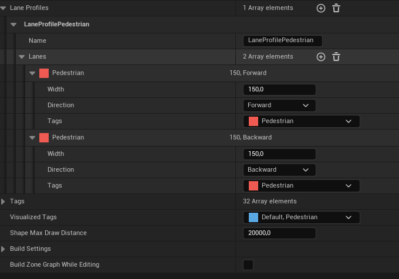

# [Tuto Viperdik](https://www.youtube.com/watch?v=bVvYn7dEqMA)

Create Blank Project in 5.2.1

Enable MASS AI plugin

Open Marketplace / Free / city sample crowd

Content Browser / CitySampleCrowd/Blueprints / BP_Crowd_characters

Enable Missing & Restart

[plugins to enable](https://forums.unrealengine.com/t/city-sample-crowds-still-not-working-in-5-2-1/1265776)

[tuto for adjusting BP](https://www.youtube.com/watch?v=WiN6C3Mi8gI)

BP_Crowd -> Class Settings -> PArent Class -> then new hierarchy

Click Viewport and adjust position -85 Z & rotation -90 Y

LOD -> Components to Sync -> Name = Mesh

# Zone Graph

Show / developper / zoneGraph

Place Actors / Zone Shape

Zone / Lane Profile / New

Tags / 1:pedestrian

Lane Profiles / add Name : LaneProfilePedestrian

Add 2 Lanes : forward & backward

Adjust the lane

Build Zone Graph

Add Data Asset/massEntityConfig in Blueprints folder

## create animation BP

add animation / animation BP / SK_base

open this BP / AssetBrowser / filter with walk / drag one in the viewport

## Back to BP_crowd_character

add RandomOptions / set to false

Mesh -> AnimClass -> NPC_anim_BP

Components / add mass agent

